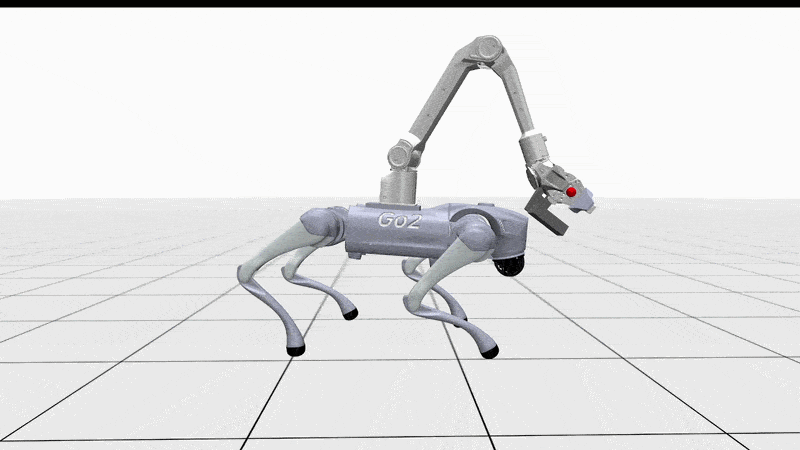

<div style="display: flex; justify-content: space-around;">
  
  
  
  <div style="display: flex; justify-content: space-around;">
    
    
    
  </div>
</div>

## Overview
An IsaacLab DirectEnv for performing teleoperation with Unitree Go2 + AgileX Piper, with scripts for sim-to-sim and sim-to-real.

Features:
- Locomotion policy able to adjust pose and carry a manipulator
- Manipulation controller using whole-body Inverse Kinematics with reduced model using [mink](https://github.com/kevinzakka/mink) + feedback linearization
- [Concurrent State Estimator](https://arxiv.org/pdf/2202.05481)
- [Rapid Motor Adaptation](https://arxiv.org/pdf/2107.04034)
- Identification of robot parameters for sim2real using [pace](https://github.com/leggedrobotics/pace-sim2real) via our repo [sim2real-robot-identification](https://github.com/iit-DLSLab/sim2real-robot-identification)
- Sim-to-Sim in [Mujoco](https://github.com/google-deepmind/mujoco)
- Sim-to-Real in ROS2 compatible with our public low-level robot's hal for Go2 [unitree_ros2_dls](https://github.com/iit-DLSLab/unitree_ros2_dls) and Agilex Piper arm [piper-ros2-dls](https://github.com/iit-DLSLab/piper-ros2-dls)


## Installation and Runs

If you want only to deploy a trained policy on your robot, continue on [README_DEPLOY](./README_DEPLOY.md) otherwise on [README_TRAIN](./README_TRAIN.md).

**For the train, check first the compatibility with IsaacLab and rsl-rl at the top of this readme. They indicate the releases that we tested.**


## Cite this work

This work takes a lot of inspiration from our repo [trash-collection-isaaclab](https://github.com/iit-DLSLab/trash-collection-isaaclab). If you find it useful, please consider citing:

#### [BinWalker: Development and Field Evaluation of a Quadruped Manipulator Platform for Sustainable Litter Collection](https://arxiv.org/pdf/2603.10529)

```
@article{turrisi26littercollection,
  author = {Giulio Turrisi and Angelo Bratta and Giovanni Minelli and Gabriel Fischer Abati and Amir H. Rad and João Carlos Virgolino Soares and Claudio Semini},
  title = {BinWalker: Development and Field Evaluation of a Quadruped Manipulator Platform for Sustainable Litter Collection},
  journal = {arXiv},
  year = {2026}
}
```


## How to contribute

PRs are very welcome (search for **TODO** in the issue, or add what you like)!

## Maintainer

This repository is maintained by [Giulio Turrisi](https://github.com/giulioturrisi).
